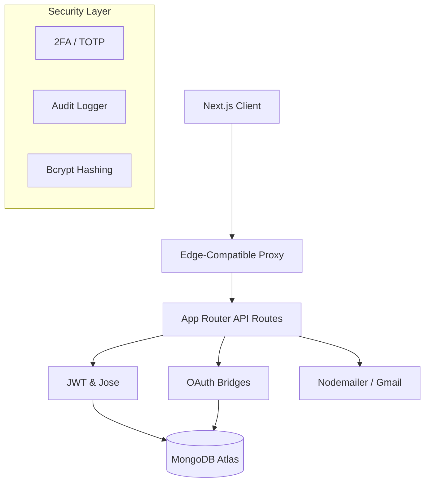

# Pro-Auth: Enterprise Next.js 16 Authentication System

A high-performance, security-first authentication suite designed for professional SaaS applications. This project demonstrates advanced implementation of modern web security, identity management, and premium UI/UX design.

## 🌟 Portfolio Highlights

This project was built to solve the "last mile" of authentication—going beyond simple login forms to provide a fully realized, production-ready security layer.

### 🔐 Multi-Layered Security
- **OAuth 2.0 Integration**: Native, custom-bridged Social Login with **Google** and **GitHub**.
- **Two-Factor Authentication (2FA)**: Robust TOTP support (Google Authenticator) with secure setup/challenge flows.
- **JWT Session Core**: Dual-token strategy (Access/Refresh) with **Rotation** and **Edge-compatible** verification.
- **Audit Logging**: Comprehensive **Security Timeline** tracking logins, profile changes, and 2FA events.

### 📧 Production Communication
- **Premium Mail Templates**: Responsive, table-based HTML email system (industry standard) for verification and resets.
- **Gmail Integration**: Configured for high deliverability via Google App Passwords.

### 🎨 Premium UI/UX
- **Dynamic Themes**: Seamless Dark/Light mode support using `next-themes` and **Tailwind CSS v4**.
- **Responsive Branding**: Purpose-built "Indigo Shield" branding and consistent "Glassmorphism" effect throughout.
- **Lucide Icons**: High-fidelity iconography for a professional, intuitive interface.

## 🏗 Technical Architecture

## 🛠 Tech Stack

- **Framework**: Next.js 16 (App Router)
- **Identity**: Custom JWT (jose), Google OAuth, GitHub OAuth
- **Database**: MongoDB with Mongoose ODM
- **Security**: otplib (2FA), bcryptjs (Hashing), Jose (Edge JWT)
- **Design**: Tailwind CSS v4, Lucide React, Sonner (Toasts)
- **Validation**: Zod (Environment & API Data)

## 🛡 Security Audit Summary

| Feature | Implementation | Client Benefit |
| :--- | :--- | :--- |
| **Session Persistence** | SameSite=Lax HttpOnly Cookies | High UX + Protection against XSS |
| **Token Rotation** | JWT Refresh Flow | Immediate session invalidation capability |
| **Account Protection** | 2FA (TOTP) | Secondary security layer for high-value accounts |
| **Audit Oversight** | MongoDB Document Store | Full traceability for security compliance |
| **DevOps Ready** | Admin Auto-Bootstrap | Instant dashboard access for reviewers/clients |

## 📦 Getting Started

1. **Clone the repo**
2. **Install**: `npm install`
3. **Configure**: Sync `.env` with provided `.env.example` (includes Google/GitHub/Gmail creds).
4. **Deploy**: Optimized for Vercel with zero-config edge middleware support.

---

## 👨‍💻 Project by [Hitesh Bhoot]
*Engineering secure, scalable, and stunning web experiences.*
